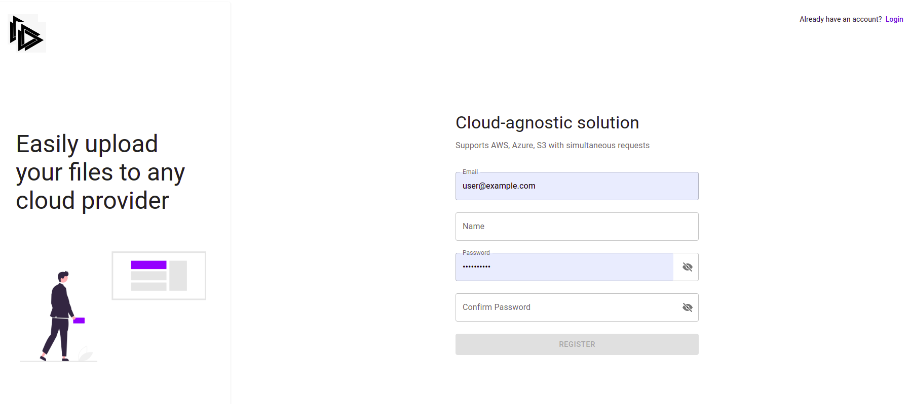
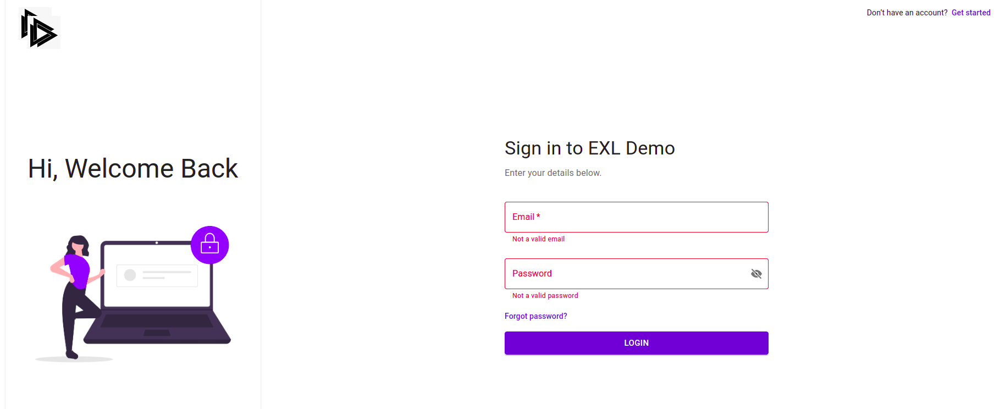
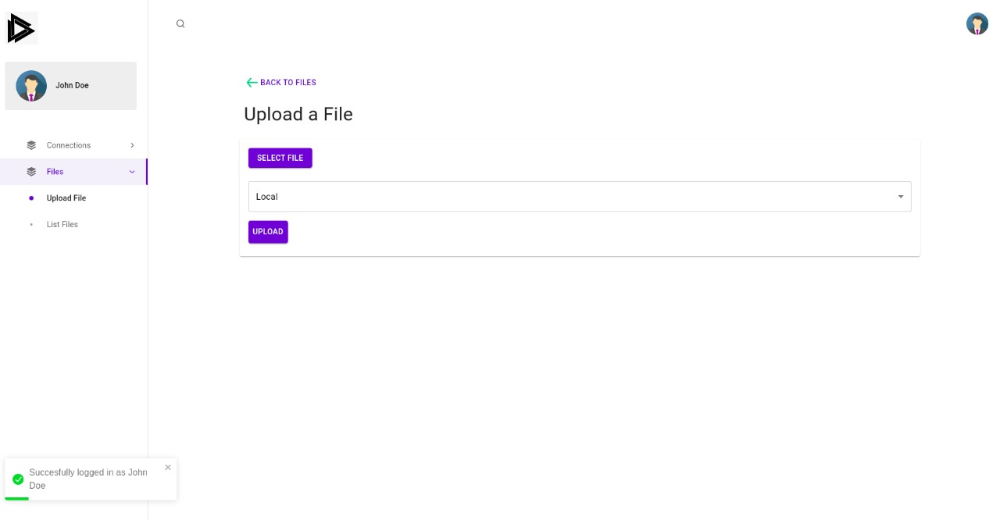
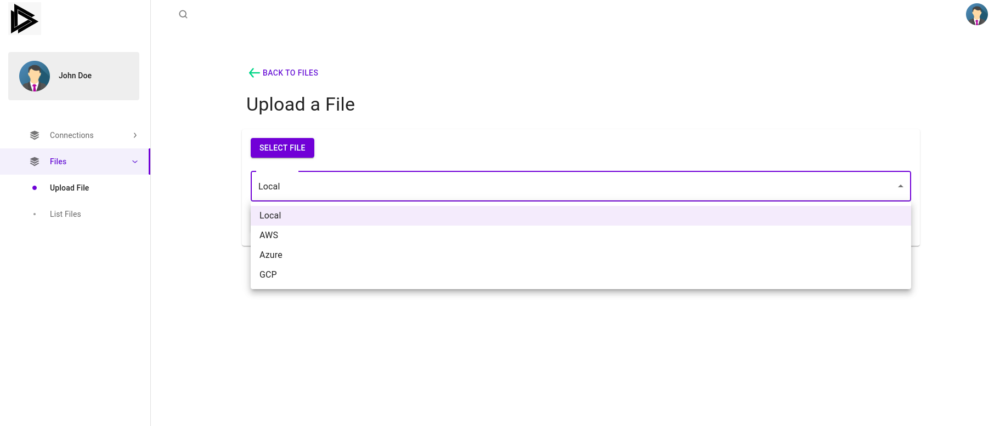
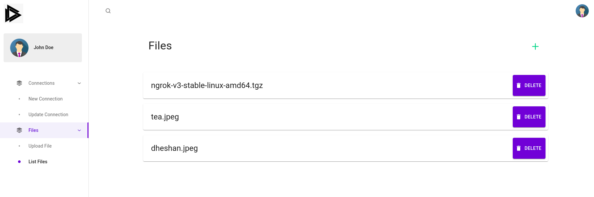

# CAFS


## Run Locally
| Backend                                                                      | Frontend                                                                    |
|------------------------------------------------------------------------------|-----------------------------------------------------------------------------|
| Clone the project <br > ```git clone https://github.com/Ohuru-Tech/cafs.git``` | Clone the project <br> ```git clone https://github.com/Ohuru-Tech/cafs.git ``` |
| Go to the project directory <br> ```cd cafs/cloud_agnostic_storage ```      | Go to the project directory <br> ```cd cafs/frontend  ```    |
| Install Dependencies <br> ``` pip3 install -r requirements.txt ```           | Install Dependencies <br>  ``` yarn install ```                              |
| Start the server  <br> ```python3 manage.py runserver ```                    | Start the server <br> ``` yarn start ```                                    |


## Demo

The project frontend has been deployed on [https://exl-hack.surge.sh/](https://exl-hack.surge.sh/)


## Documentation

- [Redoc](https://clafs.herokuapp.com/_platform/docs/v1/redoc/#operation/Connection%20Update )
- [Swagger](https://clafs.herokuapp.com/_platform/docs/v1/swagger/)


## Authors

- [@amartya-dev](https://github.com/amartya-dev)
- [@theProgrammerDavid](https://github.com/theProgrammerDavid)


## Screenshots



<hr>



<hr>



<hr>



<hr>


